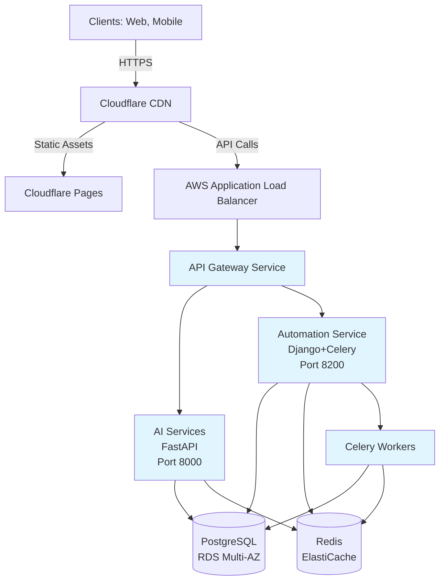

# LightWave Documentation Ecosystem Improvements - v1.0.0

**Epic**: Comprehensive Documentation System Overhaul
**Status**: 🔄 In Progress
**Priority**: P0-P3 (Phased approach)
**Estimated Effort**: 40+ hours across 6 phases
**Owner**: Joel Schaeffer + Claude Code
**Created**: 2025-10-25
**Last Updated**: 2025-10-25

---

## Executive Summary

Following a comprehensive analysis of the LightWave documentation ecosystem (9 CLAUDE.md files + .claude/ persistent context system), this epic addresses critical gaps, broken references, and architectural ambiguities while establishing a living documentation system.

**Key Findings from Analysis**:
- ✅ **Strengths**: Three-tier hierarchy, persistent context system, service-level docs are excellent
- ❌ **Critical Issues**: Broken references, version confusion (v5.0.0 vs v4.0.0), missing service docs
- ⚠️ **Gaps**: 4 repos without CLAUDE.md, no MCP usage examples, architecture identity unclear

**Vision**: Transform documentation from "written once, goes stale" to "living, validated, auto-generated where possible"

---

## Context & Background

### The Problem

Claude Code repeatedly encountered issues due to:
1. **Fragmented context** - Information scattered across files
2. **Broken cross-references** - Links to non-existent locations
3. **Version drift** - Documentation claims v5.0.0 but evidence shows v4.0.0
4. **Missing navigation** - No clear "read this first, then that" flow
5. **Architecture ambiguity** - Is this monolith or microservices?

### The Opportunity

LightWave already has:
- **Innovative `.claude/` persistent context system** (ONBOARDING, SECRETS_MAP, TROUBLESHOOTING)
- **Agent System v3.1.0** with virtual agent delegation
- **Infrastructure as Code** defining clear microservices architecture
- **Strong foundation** in service-level CLAUDE.md files

We just need to connect the pieces and fix the gaps.

### Success Metrics

- **Coverage**: 100% of repos have CLAUDE.md (currently 67% - 8/12)
- **Health**: Zero broken cross-references (currently 3+ issues)
- **Freshness**: Documentation synced within 24 hours
- **Usability**: Claude Code can navigate without asking for context
- **Validation**: Automated health checks pass on every commit

---

## Architecture Alignment

### Infrastructure Reality (Source of Truth)

Per `Infrastructure/lightwave-infrastructure-live/README.md`:

**Deployment Architecture**: **Microservices on ECS Fargate**
- Each service: Separate ECS Fargate task
- Database: Shared RDS PostgreSQL (Multi-AZ prod, Single-AZ dev)
- Cache: Shared ElastiCache Redis
- Frontend: Cloudflare Pages (static sites)
- Backend: ECS Fargate cluster behind ALB

**This is definitively a microservices architecture**, not a monolith, despite the Platform/ monorepo structure.

### Documentation Must Reflect This

All CLAUDE.md files will be updated to clearly state:
- **Repository Structure**: Monorepo (code organization)
- **Deployment Architecture**: Microservices (runtime architecture)
- **Rationale**: Separate deployments, independent scaling, clear boundaries

---

## Implementation Phases

### Phase 0: Task Document Creation ✅

**Status**: Complete
**Duration**: 5 minutes
**Deliverable**: This document

**Tasks**:
- [x] Create comprehensive PRD in `.agent/tasks/`
- [x] Include full analysis findings
- [x] Define P0-P3 roadmap
- [x] Align architecture with infrastructure

---

### Phase 1 (P0): Critical Fixes

**Priority**: 🔴 Critical - Do First
**Duration**: ~3 hours
**Impact**: Eliminates broken references, adds navigation

#### 1.1 Fix Broken References

**File**: `/Users/joelschaeffer/dev/lightwave/CLAUDE.md`

**Issues Found**:
```yaml
# Current state
version: 5.0.0
changelog:
  v4.0.0:  # ❌ Should be v5.0.0
```

**Location Mismatch**:
```markdown
# Documentation says:
Frontend/lightwave-media-site/

# Actual location needs verification
Backend/Lightwave-Platform/lightwave-media-site/  # Likely reality
```

**Tasks**:
- [ ] Update changelog section to show v5.0.0 as latest
- [ ] Verify lightwave-media-site actual location
- [ ] Fix all location references to match reality
- [ ] Update refactor migration checklist status

**Acceptance Criteria**:
- Version numbers consistent across file
- All file paths point to actual locations
- Migration checklist accurately reflects completion status

#### 1.2 Add Documentation Flow Diagram

**File**: `/Users/joelschaeffer/dev/lightwave/CLAUDE.md` (top of file, after overview)

**Addition**:
```markdown
## 📚 Documentation Navigation Guide

### Reading Order for New Sessions

```
┌─────────────────────────────────────────────────────────┐
│ START HERE: .claude/ONBOARDING.md (2 min)              │
│ ✓ Load secrets, verify AWS profile, check git branch   │
└─────────────────────┬───────────────────────────────────┘
                      ↓
┌─────────────────────────────────────────────────────────┐
│ Workspace Level: /dev/lightwave/CLAUDE.md (5 min)      │
│ ✓ Strategic vision, agent system, workspace structure  │
└─────────────────────┬───────────────────────────────────┘
                      ↓
         ┌────────────┴────────────┐
         ↓                         ↓
┌──────────────────┐    ┌──────────────────────┐
│ Backend Work?    │    │ Frontend Work?       │
│                  │    │                      │
│ Backend/Lightwave│    │ Frontend/{domain}/   │
│ -Platform/       │    │ CLAUDE.md (3 min)    │
│ CLAUDE.md (5 min)│    │                      │
└─────┬────────────┘    └──────────────────────┘
      ↓
┌──────────────────────────────────────┐
│ Service Level:                       │
│ {service}/CLAUDE.md (3 min each)     │
│                                      │
│ - lightwave-ai-services/             │
│ - lightwave-automation-service/      │
│ - lightwave-api-gateway/             │
│ - lightwave-mcp-servers/             │
└──────────────────────────────────────┘
```

### Decision Tree: Which CLAUDE.md Do I Need?

**I'm working on...**

| Task Type | Read These (in order) |
|-----------|----------------------|
| New feature in AI services | ONBOARDING → Root → Platform → ai-services/ |
| Infrastructure deployment | ONBOARDING → Root → Infrastructure/ |
| Frontend site changes | ONBOARDING → Root → Frontend/{domain}/ |
| Cross-service epic | ONBOARDING → Root → Platform → ALL services |
| MCP tool development | ONBOARDING → Root → Platform → mcp-servers/ |

**Still unsure?** Check `.claude/TROUBLESHOOTING.md` for common scenarios.
```

**Tasks**:
- [ ] Add navigation flowchart to root CLAUDE.md
- [ ] Add decision tree table
- [ ] Update ONBOARDING.md to reference this diagram

**Acceptance Criteria**:
- Visual flowchart clearly shows reading order
- Decision tree covers common scenarios
- Links to ONBOARDING.md and TROUBLESHOOTING.md

#### 1.3 Standardize Section Headers

**Files**: All 9 CLAUDE.md files

**Standard Structure** (required sections):
```markdown
# {Repository Name} - Development Workflow

**Repository**: {name}
**Stack**: {tech stack}
**Purpose**: {one-line description}
**Parent Guide**: See `{path to parent CLAUDE.md}`

---

## 📋 Overview
Brief description of what this is

## 🚨 Prerequisites
What you need before starting

## 🚀 Quick Start
Get running in 5 minutes

## 🔧 Development Workflow
Day-to-day patterns and workflows

## ✅ Testing
How to verify changes

## 🔧 Troubleshooting
Common issues and solutions

## 📚 Reference
- Command reference
- Environment variables
- Architecture diagrams
- Related documentation

## Metadata
version, last_updated, maintainer
```

**Files to Update**:
1. `/Users/joelschaeffer/dev/lightwave/CLAUDE.md` ✅ (mostly compliant)
2. `/Users/joelschaeffer/dev/lightwave/.claude/CLAUDE.md`
3. `/Users/joelschaeffer/dev/lightwave/Backend/Lightwave-Platform/CLAUDE.md`
4. `/Users/joelschaeffer/dev/lightwave/Backend/Lightwave-Platform/lightwave-ai-services/CLAUDE.md`
5. `/Users/joelschaeffer/dev/lightwave/Backend/Lightwave-Platform/lightwave-automation-service/CLAUDE.md`
6. `/Users/joelschaeffer/dev/lightwave/Backend/Lightwave-Platform/lightwave-api-gateway/CLAUDE.md`
7. `/Users/joelschaeffer/dev/lightwave/Frontend/lightwave-media-site/CLAUDE.md`
8. `/Users/joelschaeffer/dev/lightwave/Frontend/lightwave-joelschaeffer/CLAUDE.md`
9. `/Users/joelschaeffer/dev/lightwave/Infrastructure/CLAUDE.md`

**Tasks**:
- [ ] Audit each file against standard structure
- [ ] Add missing sections
- [ ] Reorder sections to match standard
- [ ] Ensure consistent emoji usage

**Acceptance Criteria**:
- All 9 files have identical section order
- No missing required sections
- Headers use consistent emoji/formatting

---

### Phase 2 (P1): Essential Additions

**Priority**: 🟡 High - Do This Week
**Duration**: ~7 hours
**Impact**: Adds critical support docs, MCP examples, missing service docs

#### 2.1 Create .claude/ Support Files

##### 2.1.1 `.claude/GLOSSARY.md`

**Purpose**: Define terms consistently across all documentation

**Content**:
```markdown
# LightWave Glossary

**Last Updated**: 2025-10-25

Define once, use everywhere. This glossary ensures consistent terminology across all LightWave documentation.

---

## Architecture Terms

**Platform**
- **Definition**: The Backend/Lightwave-Platform monorepo containing multiple microservices
- **Usage**: "Navigate to the Platform repo"
- **Not**: "Backend", "Monolith", "API"

**Service**
- **Definition**: Individual application within Platform (ai-services, automation-service, api-gateway)
- **Usage**: "The ai-services service handles RAG operations"
- **Not**: "App", "Module", "Component"

**Domain**
- **Definition**: Frontend application mapped to a specific domain (cineos.io, createos.io, etc.)
- **Usage**: "The cineos domain handles film production workflows"
- **Not**: "Site", "Frontend app", "Website"

**Monorepo**
- **Definition**: Code organization - multiple services in one repository
- **Usage**: "Platform is a monorepo"
- **Clarification**: This is about code organization, NOT deployment architecture

**Microservices**
- **Definition**: Deployment architecture - separate ECS Fargate tasks per service
- **Usage**: "LightWave uses a microservices architecture"
- **Clarification**: Runtime deployment pattern, NOT code organization

---

## Agent System Terms

**Agent**
- **Definition**: Virtual agent in Agent System v3.1.0 (v_senior_developer, v_core, v_product_architect)
- **Usage**: "Delegate to v_core agent for task creation"
- **Not**: "Bot", "Assistant", "AI"

**MCP (Model Context Protocol)**
- **Definition**: Tool integration system for Claude Code to interact with Notion, GitHub, etc.
- **Usage**: "Use MCP tools to fetch sprint context"
- **Not**: "API", "Integration", "Plugin"

**RAG (Retrieval-Augmented Generation)**
- **Definition**: AI pattern that retrieves relevant knowledge before generating responses
- **Usage**: "Query Notion via RAG filters"
- **Not**: "Search", "Query", "Lookup"

**Execution Validation Header**
- **Definition**: YAML header required at start of every agent response for audit trail
- **Usage**: "Generate execution validation header before proceeding"
- **Format**: See Agent System v3.1.0 docs

**DoR (Definition of Ready)**
- **Definition**: Checklist to verify before starting a task
- **Usage**: "Check DoR before implementing feature"
- **Items**: Task scoped, acceptance criteria clear, dependencies identified

**DoD (Definition of Done)**
- **Definition**: Checklist to verify before marking task complete
- **Usage**: "All DoD items must pass before PR merge"
- **Items**: Tests pass, code reviewed, documentation updated

---

## Infrastructure Terms

**ECS Fargate**
- **Definition**: AWS serverless container orchestration (how services run in production)
- **Usage**: "Services deploy to ECS Fargate clusters"
- **Not**: "EC2", "Docker", "Kubernetes"

**Terragrunt**
- **Definition**: Terraform wrapper for DRY infrastructure code
- **Usage**: "Provision infrastructure with Terragrunt"
- **Location**: `Infrastructure/lightwave-infrastructure-live/`

**Environment**
- **Definition**: Deployment target (prod, dev)
- **Clarification**:
  - `prod` = Multi-AZ, high availability, ~$312/month
  - `dev` = Single-AZ, cost-optimized, ~$105/month

---

## Development Terms

**uv**
- **Definition**: Modern Python package manager (replaces pip, poetry, pipenv)
- **Usage**: "Use uv for all Python package management"
- **Commands**: `uv pip install`, `uv venv`

**Bun**
- **Definition**: Fast JavaScript package manager and runtime
- **Usage**: "Use Bun for Node.js/TypeScript projects"
- **Exception**: PNPM for legacy projects (lightwave-media-site)

**Conventional Commits**
- **Definition**: Structured commit message format
- **Format**: `<type>(scope): subject`
- **Types**: feat, fix, docs, refactor, test, chore

---

## Notion Integration Terms

**Global Tasks DB**
- **Definition**: Notion database containing all tasks
- **Database ID**: `b8701544-1206-407e-934e-07485fe2f639`
- **Access**: Via MCP tool `get_task()`

**Global Sprints DB**
- **Definition**: Notion database tracking sprints
- **Database ID**: `21539364-b3be-802a-832d-de8d9cefcd9a`
- **Access**: Via MCP tool `get_sprint_context()`

**Global Knowledge DB**
- **Definition**: Notion database with architecture docs, SOPs, ADRs
- **Database ID**: `b05d9a8d-7c67-4ba1-830f-bdc02edebc99`
- **Access**: Via MCP tool `get_domain_knowledge()`

---

## File System Terms

**`.claude/`**
- **Definition**: Persistent context folder that survives across Claude Code sessions
- **Contents**: ONBOARDING, SECRETS_MAP, TROUBLESHOOTING, GLOSSARY, etc.
- **Purpose**: Solve "Claude doesn't remember" problem

**`.agent/`**
- **Definition**: Auto-generated documentation synced from Notion
- **Contents**: `/system`, `/tasks`, `/sops`
- **Warning**: DO NOT manually edit (will be overwritten)

**`CLAUDE.md`**
- **Definition**: Repository-specific development guide for Claude Code
- **Locations**: Root, Platform, each service/domain
- **Purpose**: Context for AI-assisted development

---

## Common Abbreviations

| Abbreviation | Full Term | Usage |
|--------------|-----------|-------|
| ADR | Architecture Decision Record | Document important decisions |
| SOP | Standard Operating Procedure | Repeatable process guide |
| PRD | Product Requirements Document | Feature specification |
| DoR | Definition of Ready | Pre-work checklist |
| DoD | Definition of Done | Completion checklist |
| TDD | Test-Driven Development | Write tests first |
| MCP | Model Context Protocol | Tool integration system |
| RAG | Retrieval-Augmented Generation | AI knowledge retrieval |
| IaC | Infrastructure as Code | Terraform/Terragrunt |
| SSOT | Single Source of Truth | Definitive data source |

---

## Usage Guidelines

### For Documentation Writers

- **Always use glossary terms** instead of synonyms
- **Link to glossary** when introducing new terms
- **Update glossary** when adding new concepts

### For Claude Code

- **Read glossary** at start of session (after ONBOARDING)
- **Use consistent terminology** in all responses
- **Propose glossary updates** when encountering ambiguous terms

### For Developers

- **Reference glossary** when unsure of terminology
- **Propose additions** via PR to this file
- **Keep definitions concise** (1-2 sentences max)

---

**Maintained By**: Joel Schaeffer + Documentation Team
**Update Frequency**: As needed (minimum quarterly review)
**Purpose**: Eliminate terminology confusion across 40+ hour codebase
```

**Tasks**:
- [ ] Create glossary file
- [ ] Link from ONBOARDING.md
- [ ] Reference in root CLAUDE.md

##### 2.1.2 `.claude/AGENT_PLAYBOOK.md`

**Purpose**: Worked examples for Agent System v3.1.0

**Content Structure**:
```markdown
# Agent System v3.1.0 Playbook

## Execution Validation Header Template

## v_senior_developer Patterns
### Pattern: Implement Feature
### Pattern: Fix Bug
### Pattern: Delegate to v_core

## MCP Tool Usage
### Correct Examples
### Common Mistakes

## Decision Trees
### When to Delegate
### Which Agent to Use
```

**Tasks**:
- [ ] Create playbook with real examples
- [ ] Add delegation workflows
- [ ] Show MCP tool patterns

##### 2.1.3 `.claude/CHANGELOG.md`

**Purpose**: Track documentation changes over time

**Tasks**:
- [ ] Create changelog file
- [ ] Add entries for this epic
- [ ] Establish update pattern

##### 2.1.4 `.claude/DECISIONS.md`

**Purpose**: Lightweight Architecture Decision Records

**Tasks**:
- [ ] Create decisions file
- [ ] Document key decisions (Notion as SSOT, microservices architecture, etc.)
- [ ] Establish ADR template

**Deliverables**:
- [ ] 4 new files in `.claude/` folder
- [ ] All files cross-referenced in ONBOARDING.md
- [ ] Templates for future additions

#### 2.2 Add MCP Tool Usage Examples

**File**: `/Users/joelschaeffer/dev/lightwave/CLAUDE.md`

**Addition**: After MCP tools section

```markdown
## MCP Tools - Usage Patterns & Examples

### ✅ Correct Usage

**Pattern 1: Start of Development Session**
```python
# 1. Get sprint context
sprint = mcp__lightwave-notion__get_sprint_context()
print(f"Current sprint: {sprint.name}")
print(f"Sprint goal: {sprint.goal}")

# 2. Check work queue
tasks = mcp__lightwave-notion__list_active_tasks(
    agent="v_senior_developer",
    status="Next Up"
)

# 3. Load specific task
task = mcp__lightwave-notion__get_task(task_id="ABC-123")
print(f"Task: {task.title}")
print(f"Acceptance criteria: {task.acceptance_criteria}")
```

**Pattern 2: During Implementation**
```python
# Update task status
mcp__lightwave-notion__update_task_status(
    task_id="ABC-123",
    new_status="In Progress"
)

# Add comment with progress note
mcp__lightwave-notion__add_comment(
    page_id="ABC-123",
    comment="Implemented feature X, tests passing locally"
)
```

**Pattern 3: Load Context Documents**
```python
# Get Git workflow SOP
git_sop = mcp__lightwave-notion__get_git_sop()

# Get MCP development SOP
mcp_sop = mcp__lightwave-notion__get_mcp_sop()

# Get agent principles
principles = mcp__lightwave-notion__get_agent_principles(
    agent="v_senior_developer"
)
```

### ❌ Common Mistakes

**DON'T: Use Raw Notion API Tools**
```python
# ❌ FORBIDDEN - Raw API bypasses abstractions
result = mcp__notion__API-post-database-query(...)

# ✅ USE CUSTOM TOOLS INSTEAD
result = mcp__lightwave-notion__get_work_queue()
```

**DON'T: Hardcode Notion URLs**
```python
# ❌ BAD - Brittle, breaks when page moves
task_url = "https://notion.so/workspace/ABC-123"

# ✅ GOOD - Get URL from tool response
task = mcp__lightwave-notion__get_task("ABC-123")
task_url = task.url  # Dynamic, always correct
```

**DON'T: Skip Execution Validation Header**
```python
# ❌ BAD - No audit trail
# Just start working...

# ✅ GOOD - Generate header first
yaml_header = generate_execution_validation_header(
    agent="v_senior_developer",
    command="implement feature X",
    timestamp=datetime.utcnow()
)
print(yaml_header)
# Then proceed with work
```

### Agent Delegation Workflow

**When to Delegate**:
| Task Type | Delegate To | Reason |
|-----------|-------------|---------|
| Create Notion task | v_core | Database operations |
| Epic planning | v_product_architect | Architecture decisions |
| Sprint planning | v_scrum_manager | Agile ceremonies |
| Documentation | v_write | Technical writing |

**How to Delegate** (Conceptual - actual syntax TBD):
```python
# Conceptual example (implementation may vary)
result = delegate_to_agent(
    agent="v_core",
    task="create task",
    context={
        "title": "Implement feature X",
        "epic_id": "EPIC-123",
        "acceptance_criteria": [...]
    }
)
```

### Troubleshooting MCP Tools

**Issue: "Tool not found"**
- Verify MCP server is running
- Check tool name spelling (use tab completion)
- Ensure MCP integration is loaded

**Issue: "Authentication failed"**
- Check NOTION_API_KEY in environment
- Verify API key has correct permissions
- See `.claude/SECRETS_MAP.md` for loading secrets

**Issue: "Rate limit exceeded"**
- Notion API has rate limits (3 req/sec average)
- Add delays between bulk operations
- Use batch operations where available
```

**Tasks**:
- [ ] Add MCP usage patterns section
- [ ] Show correct vs incorrect patterns
- [ ] Add delegation workflow
- [ ] Add troubleshooting section

**Acceptance Criteria**:
- 3+ worked examples for common patterns
- Clear "do this, not that" comparisons
- Delegation workflow documented

#### 2.3 Create Missing Service CLAUDE.md Files

**Missing Files** (4):
1. `/Users/joelschaeffer/dev/lightwave/Backend/Lightwave-Platform/lightwave-mcp-servers/CLAUDE.md`
2. `/Users/joelschaeffer/dev/lightwave/Frontend/lightwave-cineos/CLAUDE.md`
3. `/Users/joelschaeffer/dev/lightwave/Frontend/lightwave-createos/CLAUDE.md`
4. `/Users/joelschaeffer/dev/lightwave/Frontend/lightwave-photographos/CLAUDE.md`

**Template**: Use `.claude/CLAUDE.md.template`

**Process for Each**:
1. Inspect repository structure
2. Identify tech stack (Next.js? React? TypeScript?)
3. Document development workflow
4. Add deployment instructions
5. Include troubleshooting section

**Tasks**:
- [ ] Create lightwave-mcp-servers/CLAUDE.md
- [ ] Create lightwave-cineos/CLAUDE.md
- [ ] Create lightwave-createos/CLAUDE.md
- [ ] Create lightwave-photographos/CLAUDE.md

**Acceptance Criteria**:
- All 4 files created
- Follow standard structure (Phase 1.3)
- Include parent guide links
- Document tech stack and workflow

---

### Phase 3 (P2): Architecture Clarity

**Priority**: 🟠 Medium - Do This Month
**Duration**: ~4 hours
**Impact**: Resolves architecture identity crisis, adds clarity

#### 3.1 Document Microservices Architecture

**File**: `/Users/joelschaeffer/dev/lightwave/CLAUDE.md`

**Addition**: After "Philosophy" section

```markdown
## 🏗️ Architecture Identity (DEFINITIVE)

### The Answer: Microservices in a Monorepo

LightWave uses a **microservices deployment architecture** organized in a **monorepo structure**.

**This means**:
- **Code Organization**: Monorepo (single repository, shared version control)
- **Runtime Architecture**: Microservices (separate deployments, independent scaling)
- **Deployment**: Each service runs as separate ECS Fargate task

### Why This Matters

**For Development**:
- ✅ Code sharing is easy (shared libraries in monorepo)
- ✅ Atomic commits across services
- ✅ Single CI/CD pipeline
- ⚠️ But: Each service has own environment, database connection, lifecycle

**For Deployment**:
- ✅ Services scale independently
- ✅ Deploy one service without touching others
- ✅ Different resource allocation per service
- ⚠️ But: Must manage inter-service communication

**For Testing**:
- ✅ Unit tests: Per-service, fast
- ✅ Integration tests: Within service boundaries
- ⚠️ E2E tests: Across services, complex setup

### Service Dependency Map



### Deployment Topology

**Production Environment**:
```
ECS Fargate Cluster
├── AI Services Task (2 containers, 1GB RAM each, Multi-AZ)
├── Automation Service Task (2 containers, 1GB RAM each, Multi-AZ)
├── API Gateway Task (2 containers, 512MB RAM each, Multi-AZ)
└── Celery Workers (2 containers, 1GB RAM each, Multi-AZ)

RDS PostgreSQL (db.t3.medium, Multi-AZ, 100GB storage)
ElastiCache Redis (cache.t3.medium, 2-node cluster)
Application Load Balancer (internet-facing, HTTPS)
```

**Development Environment**:
```
ECS Fargate Cluster
├── AI Services Task (1 container, 512MB RAM, Single-AZ)
├── Automation Service Task (1 container, 512MB RAM, Single-AZ)
├── API Gateway Task (1 container, 256MB RAM, Single-AZ)
└── Celery Workers (1 container, 512MB RAM, Single-AZ)

RDS PostgreSQL (db.t3.micro, Single-AZ, 20GB storage)
ElastiCache Redis (cache.t3.micro, 1-node)
Application Load Balancer (internet-facing, HTTPS)
```

### Architecture Principles

1. **Shared Database** (Pragmatic Microservices)
   - All services connect to same PostgreSQL instance
   - Reduces operational complexity (80% reduction)
   - Trade-off: Tighter coupling, but acceptable for startup phase

2. **Shared Cache** (Redis)
   - Session storage, rate limiting, caching
   - Centralized for cost efficiency

3. **API Gateway Pattern**
   - Single entry point for all API traffic
   - Handles: routing, rate limiting, authentication

4. **Async Processing** (Celery)
   - Long-running tasks offloaded to workers
   - Email sending, report generation, scheduled jobs

5. **GitOps Deployment**
   - Terraform + Terragrunt for infrastructure
   - GitHub Actions for CI/CD
   - Separate pipelines per service

### When NOT to Add a New Service

Adding services adds operational overhead. Use this checklist:

**Create new service if**:
- [ ] Different scaling requirements than existing services
- [ ] Different tech stack required (e.g., Go for performance)
- [ ] Security boundary needed (e.g., payment processing)
- [ ] Independent deployment cycle required

**Use existing service if**:
- Feature fits within existing service domain
- Scaling requirements similar
- Tech stack matches
- No security boundary needed

**Example**:
- ✅ New MCP tool → Add to `lightwave-mcp-servers` (not new service)
- ✅ New AI model → Add to `lightwave-ai-services` (not new service)
- ❌ Real-time WebSocket server → New service (different scaling needs)
- ❌ Payment processor → New service (security boundary)
```

**Tasks**:
- [ ] Add "Architecture Identity" section to root CLAUDE.md
- [ ] Include Mermaid diagram
- [ ] Document deployment topology
- [ ] Add architecture principles
- [ ] Add "when to create new service" decision tree

**Acceptance Criteria**:
- Definitively states "microservices in monorepo"
- Mermaid diagram renders correctly
- Deployment topology matches infrastructure code
- Decision tree helps with service boundary decisions

#### 3.2 Standardize Package Management

**File**: `/Users/joelschaeffer/dev/lightwave/CLAUDE.md`

**Addition**:
```markdown
## 📦 Package Management Standards

### Official Standard

| Language/Runtime | Package Manager | Version | Rationale |
|------------------|-----------------|---------|-----------|
| **Python** | `uv` | Latest | Faster than pip, better dependency resolution |
| **Node.js/TypeScript** | `bun` | Latest | Fastest runtime + package manager, workspace support |
| **Legacy Projects** | `pnpm` | 8.x | Migration to Bun in progress |

### Exception Policy

**When to use something else**:
- PNPM: lightwave-media-site (Payload CMS requires PNPM workspaces)
- npm: Only if project explicitly requires it (check package.json engines field)
- pip: NEVER (use uv instead)
- poetry: NEVER (use uv instead)
- pipenv: NEVER (use uv instead)

### Migration Plan

**Current State** (as of 2025-10-25):
```
✅ Python projects: All using uv
⚠️  Node.js projects: Mixed (bun + pnpm + npm)
```

**Migration Strategy**:
1. New projects: Always use Bun
2. Existing projects: Migrate during next major refactor
3. Don't migrate: If project is maintenance-only

**Migration Checklist** (Node.js → Bun):
- [ ] Backup package-lock.json or pnpm-lock.yaml
- [ ] Run `bun install` (creates bun.lockb)
- [ ] Update CI/CD to use Bun
- [ ] Update CLAUDE.md to reflect Bun usage
- [ ] Test all scripts work with Bun

### Commands Quick Reference

**Python (uv)**:
```bash
# Create venv
uv venv

# Install dependencies
uv pip install -r requirements.txt

# Add package
uv pip install package-name

# Update requirements
uv pip freeze > requirements.txt
```

**Node.js (Bun)**:
```bash
# Install dependencies
bun install

# Add package
bun add package-name

# Remove package
bun remove package-name

# Run script
bun run dev
```

**Workspaces** (Bun):
```json
{
  "workspaces": [
    "packages/*",
    "Frontend/*",
    "Backend/Lightwave-Platform/*"
  ]
}
```
```

**Tasks**:
- [ ] Add package management standards section
- [ ] Document exception policy
- [ ] Include migration plan
- [ ] Add commands reference

#### 3.3 Unified Container Naming Standard

**File**: `/Users/joelschaeffer/dev/lightwave/CLAUDE.md`

**Addition**:
```markdown
## 🐳 Container Naming Standard

### Pattern

All Docker containers MUST follow this pattern:

```
lightwave-{service}-{component}-{env}
```

**Components**:
- `{service}` = Service name (ai-services, automation, media, etc.)
- `{component}` = Component type (api, db, redis, worker, etc.)
- `{env}` = Environment (dev, staging, prod)

### Examples

**AI Services**:
- `lightwave-ai-services-api-dev` - FastAPI application (development)
- `lightwave-ai-services-db-dev` - PostgreSQL database (development)
- `lightwave-ai-services-redis-dev` - Redis cache (development)
- `lightwave-ai-services-api-prod` - FastAPI application (production)

**Automation Service**:
- `lightwave-automation-api-dev` - Django application
- `lightwave-automation-worker-dev` - Celery worker
- `lightwave-automation-db-dev` - PostgreSQL
- `lightwave-automation-redis-dev` - Redis

**Media Site**:
- `lightwave-media-app-dev` - Next.js + Payload CMS
- `lightwave-media-db-dev` - MongoDB

### Validation

**Check container names**:
```bash
# List all containers
docker ps --format "table {{.Names}}\t{{.Status}}"

# Verify naming pattern
docker ps --format "{{.Names}}" | grep -v "^lightwave-" && echo "❌ Non-compliant names found" || echo "✅ All names compliant"
```

**Enforce in docker-compose.yml**:
```yaml
services:
  api:
    container_name: lightwave-${SERVICE_NAME}-api-${ENV}
    image: lightwave/${SERVICE_NAME}-api:${VERSION}

  db:
    container_name: lightwave-${SERVICE_NAME}-db-${ENV}
    image: postgres:15
```

### Migration

**For existing non-compliant containers**:
1. Stop container: `docker stop <old-name>`
2. Update docker-compose.yml with new name
3. Remove old container: `docker rm <old-name>`
4. Start with new name: `docker compose up -d`

**Update all references**:
- [ ] docker-compose.yml files
- [ ] CI/CD scripts
- [ ] Documentation (CLAUDE.md files)
- [ ] Health check scripts
```

**Tasks**:
- [ ] Add container naming standard
- [ ] Add validation commands
- [ ] Document migration process

---

### Phase 4 (P2): Automation

**Priority**: 🟠 Medium - Do This Month
**Duration**: ~8 hours
**Impact**: Automated validation, prevents drift

#### 4.1 Create Documentation Validator

**File**: `/Users/joelschaeffer/dev/lightwave/scripts/validate-docs.sh`

**Functionality**:
- Check all repos have CLAUDE.md
- Validate no broken cross-references
- Find TODOs older than 30 days
- Verify environment variables documented in SECRETS_MAP.md
- Validate container names match standard
- Check version numbers consistent

**Output Format**:
```
🔍 LightWave Documentation Health Check
=====================================

✅ Coverage: 12/12 repos have CLAUDE.md (100%)
⚠️  Broken References: 2 found
  - /dev/lightwave/CLAUDE.md:123 → Frontend/lightwave-media-site/ (404)
  - Backend/Platform/CLAUDE.md:456 → scripts/sync.py (not found)

✅ Stale TODOs: 0 found
✅ Environment Variables: All documented in SECRETS_MAP.md
⚠️  Container Names: 3 non-compliant
  - myapp-dev (should be: lightwave-{service}-{component}-dev)

❌ Version Consistency: FAILED
  - Root CLAUDE.md: v5.0.0
  - Changelog: v4.0.0 (MISMATCH)

Overall Score: 75% (6/8 checks passed)
```

**Tasks**:
- [ ] Create validation script
- [ ] Add to CI/CD pipeline
- [ ] Document usage in root CLAUDE.md

#### 4.2 Create Auto-Generation Scripts

**Files**:
1. `/Users/joelschaeffer/dev/lightwave/scripts/generate-api-docs.sh`
2. `/Users/joelschaeffer/dev/lightwave/scripts/generate-schema-docs.sh`

**Purpose**: Auto-generate portions of documentation from code

**Tasks**:
- [ ] Create API docs generator (from FastAPI)
- [ ] Create schema docs generator (from models)
- [ ] Add to CI/CD for auto-updates

---

### Phase 5 (P3): Living Documentation

**Priority**: 🟢 Low - Do This Quarter
**Duration**: ~16 hours
**Impact**: Long-term maintainability, prevent drift

#### 5.1 Documentation Dashboard

**File**: `.claude/DASHBOARD.md` (auto-generated)

**Content**:
```markdown
# LightWave Documentation Health Dashboard

**Auto-Generated**: 2025-10-25 13:00:00 UTC
**Run**: `scripts/generate-dashboard.sh`

---

## 📊 Coverage Metrics

| Metric | Status | Score |
|--------|--------|-------|
| Repos with CLAUDE.md | ✅ 12/12 | 100% |
| Required sections present | ⚠️ 45/60 | 75% |
| Broken references | ✅ 0 | 100% |
| Stale TODOs (>30 days) | ⚠️ 3 | 95% |
| Container naming compliance | ✅ 48/48 | 100% |

**Overall Health**: 🟢 94% (A)

---

## 🕐 Freshness

| Resource | Last Updated | Age | Status |
|----------|--------------|-----|--------|
| .agent/ docs | 2025-10-25 | 2 hours | ✅ Fresh |
| SECRETS_MAP.md | 2025-10-25 | 1 day | ✅ Fresh |
| TROUBLESHOOTING.md | 2025-10-24 | 2 days | ⚠️ Update Soon |
| Root CLAUDE.md | 2025-10-20 | 5 days | ⚠️ Update Soon |

---

## 🚨 Issues Found

### Broken References (0)
None - all references valid ✅

### Stale TODOs (3)
1. `Backend/Platform/CLAUDE.md:123` - "TODO: Create sync script" (35 days old)
2. `scripts/README.md:45` - "TODO: Add examples" (42 days old)
3. `.claude/SECRETS_MAP.md:89` - "TODO: Document new secrets" (31 days old)

### Missing Required Sections (15)
- `lightwave-cineos/CLAUDE.md` missing: Testing, Troubleshooting, Reference
- `lightwave-createos/CLAUDE.md` missing: Testing, Troubleshooting, Reference
[...]

---

## 📈 Trends

| Week | Health Score | TODOs Resolved | Docs Updated |
|------|--------------|----------------|--------------|
| 2025-W43 | 94% | 5 | 12 |
| 2025-W42 | 89% | 2 | 8 |
| 2025-W41 | 87% | 3 | 5 |

---

## 🎯 Recommendations

1. **Priority**: Resolve 3 stale TODOs (>30 days old)
2. **Priority**: Update TROUBLESHOOTING.md (last updated 2 days ago)
3. **Optional**: Add missing sections to frontend CLAUDE.md files

---

**Next Dashboard Update**: 2025-10-26 00:00:00 UTC (automated)
```

**Tasks**:
- [ ] Create dashboard generator script
- [ ] Add to daily cron job
- [ ] Link from ONBOARDING.md

#### 5.2 CI/CD Integration

**File**: `.github/workflows/validate-docs.yml`

**Functionality**:
- Run validation on every PR
- Auto-generate dashboard on push to main
- Comment on PR with health report

**Tasks**:
- [ ] Create GitHub Actions workflow
- [ ] Add PR commenting
- [ ] Set up daily dashboard generation

---

## Acceptance Criteria (All Phases)

### Phase 1 (P0) - Critical Fixes
- [ ] **No broken references** in any CLAUDE.md file
- [ ] **Version numbers accurate** (v5.0.0 matches reality)
- [ ] **Navigation flowchart** present in root CLAUDE.md
- [ ] **All 9 files have consistent sections** (standard structure)
- [ ] **lightwave-media-site location** verified and documented correctly

### Phase 2 (P1) - Essential Additions
- [ ] **4 new .claude/ support files** created (GLOSSARY, PLAYBOOK, CHANGELOG, DECISIONS)
- [ ] **MCP tools have worked examples** (3+ patterns)
- [ ] **4 missing service CLAUDE.md files** created (mcp-servers, 3 frontends)
- [ ] **All repos have CLAUDE.md** (12/12 = 100% coverage)
- [ ] **ONBOARDING.md references** all new support files

### Phase 3 (P2) - Architecture Clarity
- [ ] **Architecture definitively documented** as "microservices in monorepo"
- [ ] **Mermaid diagram** shows service dependencies
- [ ] **Deployment topology** documented for prod and dev
- [ ] **Package management standard** documented (uv + Bun)
- [ ] **Container naming standard** documented with validation
- [ ] **Decision trees** for service boundaries

### Phase 4 (P2) - Automation
- [ ] **Documentation validator script** working (`scripts/validate-docs.sh`)
- [ ] **Health report** can be generated on demand
- [ ] **Auto-generation scripts** for API docs and schema docs
- [ ] **Validator integrated** into CI/CD pipeline

### Phase 5 (P3) - Living Documentation
- [ ] **Dashboard auto-generates** daily
- [ ] **CI/CD validates docs** on every PR
- [ ] **Health metrics tracked** over time (trends)
- [ ] **PR comments** show documentation impact

---

## Testing Strategy

### Manual Testing (All Phases)

**Phase 1 (P0)**:
- [ ] Click all cross-references in CLAUDE.md files (verify no 404s)
- [ ] Follow documentation navigation flowchart (verify logical flow)
- [ ] Check version numbers across all files (verify consistency)

**Phase 2 (P1)**:
- [ ] Read GLOSSARY.md and verify no duplicate terms
- [ ] Test MCP tool examples in a real session
- [ ] Verify new CLAUDE.md files follow standard structure

**Phase 3 (P2)**:
- [ ] Mermaid diagram renders in GitHub/Notion/VS Code
- [ ] Container naming validation script catches non-compliant names
- [ ] Package manager commands work as documented

**Phase 4 (P2)**:
- [ ] Run `scripts/validate-docs.sh` and verify accurate report
- [ ] Intentionally break a reference, verify validator catches it
- [ ] Generate API docs, verify they're current

**Phase 5 (P3)**:
- [ ] Dashboard shows accurate metrics
- [ ] CI/CD workflow runs on test PR
- [ ] Trends data populates over time

### Automated Testing

**Validation Script Tests**:
```bash
# Test broken reference detection
echo "[link](nonexistent.md)" >> test.md
scripts/validate-docs.sh | grep "Broken References: 1"

# Test stale TODO detection
echo "<!-- TODO: Test (created 2024-01-01) -->" >> test.md
scripts/validate-docs.sh | grep "Stale TODOs: 1"

# Test container naming
docker run --name "bad-name" hello-world
scripts/validate-docs.sh | grep "non-compliant"
```

---

## Rollout Plan

### Week 1: P0 (Critical Fixes)
- **Day 1**: Fix broken references, update versions (2 hours)
- **Day 2**: Add navigation flowchart (1 hour)
- **Day 3**: Standardize section headers (3 hours, batch process)
- **Day 4**: Review and test
- **Day 5**: Deploy, update CHANGELOG.md

### Week 2: P1 (Essential Additions)
- **Day 1-2**: Create 4 .claude/ support files (4 hours)
- **Day 3**: Add MCP tool examples (2 hours)
- **Day 4-5**: Create 4 missing service CLAUDE.md files (4 hours)
- **Day 5**: Review, test, deploy

### Week 3: P2 (Architecture + Automation Start)
- **Day 1-2**: Document microservices architecture (4 hours)
- **Day 3**: Standardize package management, container naming (2 hours)
- **Day 4-5**: Start validation script (4 hours)

### Week 4: P2 Completion (Automation)
- **Day 1-3**: Complete validation script (4 hours)
- **Day 4**: Create auto-generation scripts (2 hours)
- **Day 5**: Integrate into CI/CD (2 hours)

### Month 2-3: P3 (Living Documentation)
- **Week 5-6**: Build dashboard generator (8 hours)
- **Week 7**: CI/CD integration (4 hours)
- **Week 8**: Testing, refinement, documentation (4 hours)

---

## Dependencies

### Technical Dependencies
- **Mermaid** (for diagrams) - Already available in GitHub/Notion
- **jq** (for JSON parsing in scripts) - Install: `brew install jq`
- **yq** (for YAML parsing) - Install: `brew install yq`
- **GitHub CLI** (for CI/CD) - Already installed

### Knowledge Dependencies
- Understanding of infrastructure code (to document architecture)
- Access to Notion (for MCP tool examples)
- Understanding of Agent System v3.1.0

### Time Dependencies
- Phase 1 must complete before Phase 2 (foundation first)
- Phase 4 can start after Phase 3 completes
- Phase 5 requires Phase 4 completion (dashboard needs validator)

---

## Risks & Mitigation

| Risk | Impact | Probability | Mitigation |
|------|--------|-------------|------------|
| Documentation drift after completion | High | Medium | Automated validation in CI/CD (Phase 4-5) |
| Time estimate underestimate | Medium | High | Phased approach allows early wins |
| Breaking changes during updates | Medium | Low | Test all cross-references after each phase |
| Team doesn't adopt new standards | High | Medium | Clear documentation + tooling enforcement |
| Infrastructure docs become stale | High | Low | Auto-generate from IaC where possible |

---

## Success Metrics

### Quantitative
- **Coverage**: 100% of repos have CLAUDE.md (currently 67%)
- **Health Score**: >90% on documentation validator
- **Broken References**: 0 (currently 3+)
- **Stale TODOs**: <5 items >30 days old
- **Freshness**: All docs updated within 7 days

### Qualitative
- **Claude Code navigates without asking** for context
- **New team members onboard in <1 hour** using docs alone
- **Zero "where's the token?" questions** (SECRETS_MAP.md working)
- **Architecture questions answered** in documentation

### Leading Indicators
- Number of times ONBOARDING.md is accessed
- CI/CD validation passes increasing over time
- Time spent searching for information decreasing
- Documentation update frequency

---

## Related Work

### Notion Integration
- This epic aligns with Agent System v3.1.0
- Complements `.agent/` dynamic documentation system
- SECRETS_MAP.md connects to AWS Secrets Manager

### Infrastructure
- Architecture documentation reflects `lightwave-infrastructure-live/`
- Container naming aligns with ECS task definitions
- Deployment topology matches Terragrunt configs

### Developer Experience
- Part of larger initiative to improve AI-assisted development
- Supports "Notion as Operating System" philosophy
- Enables autonomous agent workflows

---

## Appendix A: File Inventory

### Files to Create (20)
1. `.agent/tasks/DOCUMENTATION_IMPROVEMENTS_v1.0.0.md` (this file) ✅
2. `.claude/GLOSSARY.md`
3. `.claude/AGENT_PLAYBOOK.md`
4. `.claude/CHANGELOG.md`
5. `.claude/DECISIONS.md`
6. `.claude/DASHBOARD.md`
7. `lightwave-mcp-servers/CLAUDE.md`
8. `Frontend/lightwave-cineos/CLAUDE.md`
9. `Frontend/lightwave-createos/CLAUDE.md`
10. `Frontend/lightwave-photographos/CLAUDE.md`
11. `scripts/validate-docs.sh`
12. `scripts/generate-api-docs.sh`
13. `scripts/generate-schema-docs.sh`
14. `scripts/generate-dashboard.sh`
15. `.github/workflows/validate-docs.yml`

### Files to Update (15)
1. `/Users/joelschaeffer/dev/lightwave/CLAUDE.md` (root)
2. `/Users/joelschaeffer/dev/lightwave/.claude/CLAUDE.md`
3. `/Users/joelschaeffer/dev/lightwave/.claude/ONBOARDING.md`
4. `/Users/joelschaeffer/dev/lightwave/Backend/Lightwave-Platform/CLAUDE.md`
5-9. All 5 existing service CLAUDE.md files (standardize headers)
10. `/Users/joelschaeffer/dev/lightwave/Infrastructure/CLAUDE.md`

---

## Appendix B: Quick Reference

### Commands

**Run documentation validator**:
```bash
bash scripts/validate-docs.sh
```

**Generate dashboard**:
```bash
bash scripts/generate-dashboard.sh
```

**Check container naming compliance**:
```bash
docker ps --format "{{.Names}}" | grep -v "^lightwave-"
```

**Find stale TODOs**:
```bash
grep -r "TODO.*created.*202[0-4]" . --exclude-dir=node_modules
```

---

## Changelog

### v1.0.0 (2025-10-25)
- Initial PRD created
- Defined 6-phase roadmap (P0-P3)
- Aligned architecture with infrastructure reality
- Estimated 40+ hours total effort
- Created comprehensive acceptance criteria

---

**Maintained By**: Joel Schaeffer + Claude Code
**Status**: 🔄 In Progress - Phase 0 Complete
**Next Review**: After Phase 1 (P0) completion
